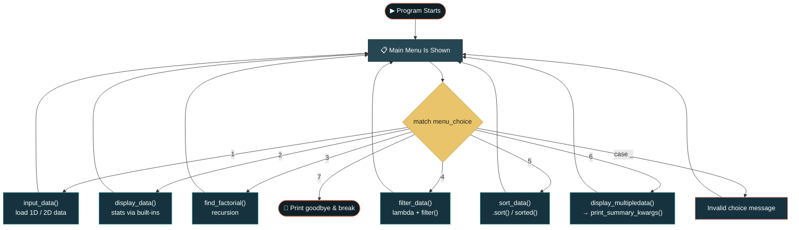

<div align="center">

```
██████╗  █████╗ ████████╗ █████╗ 
██╔══██╗██╔══██╗╚══██╔══╝██╔══██╗
██║  ██║███████║   ██║   ███████║
██║  ██║██╔══██║   ██║   ██╔══██║
██████╔╝██║  ██║   ██║   ██║  ██║
╚═════╝ ╚═╝  ╚═╝   ╚═╝   ╚═╝  ╚═╝

 █████╗ ███╗   ██╗ █████╗ ██╗  ██╗   ██╗███████╗███████╗██████╗ 
██╔══██╗████╗  ██║██╔══██╗██║  ╚██╗ ██╔╝╚══███╔╝██╔════╝██╔══██╗
███████║██╔██╗ ██║███████║██║   ╚████╔╝   ███╔╝ █████╗  ██████╔╝
██╔══██║██║╚██╗██║██╔══██║██║    ╚██╔╝   ███╔╝  ██╔══╝  ██╔══██╗
██║  ██║██║ ╚████║██║  ██║███████╗██║   ███████╗███████╗██║  ██║
╚═╝  ╚═╝╚═╝  ╚═══╝╚═╝  ╚═╝╚══════╝╚═╝   ╚══════╝╚══════╝╚═╝  ╚═╝

████████╗██████╗  █████╗ ███╗   ██╗███████╗███████╗ ██████╗ ██████╗ ███╗   ███╗███████╗██████╗ 
╚══██╔══╝██╔══██╗██╔══██╗████╗  ██║██╔════╝██╔════╝██╔═══██╗██╔══██╗████╗ ████║██╔════╝██╔══██╗
   ██║   ██████╔╝███████║██╔██╗ ██║███████╗█████╗  ██║   ██║██████╔╝██╔████╔██║█████╗  ██████╔╝
   ██║   ██╔══██╗██╔══██║██║╚██╗██║╚════██║██╔══╝  ██║   ██║██╔══██╗██║╚██╔╝██║██╔══╝  ██╔══██╗
   ██║   ██║  ██║██║  ██║██║ ╚████║███████║██║     ╚██████╔╝██║  ██║██║ ╚═╝ ██║███████╗██║  ██║
   ╚═╝   ╚═╝  ╚═╝╚═╝  ╚═╝╚═╝  ╚═══╝╚══════╝╚═╝      ╚═════╝ ╚═╝  ╚═╝╚═╝     ╚═╝╚══════╝╚═╝  ╚═╝
```

[](https://git.io/typing-svg)


</div>

## 🧭 Table of Contents

[Overview](#-project-overview) • [Objective](#-objective) • [Data Storage](#-data-storage) • [Functions](#-functions-overview) • [Features](#-features) • [Flow](#-program-flow) • [Example Output](#-example-output) • [Skills](#-skills-demonstrated) • [Known Behaviors](#-known-behaviors--notes) • [Getting Started](#-getting-started) • [Structure](#-project-structure) • [Tech Stack](#-tech-stack) • [Author](#-author) • [Full Code](#-full-source-code)

---

## 📌 Project Overview

**Data Analyzer and Transformer** is a menu-driven Python console program that lets a user load a 1D array or a simple 2D matrix, then run analysis and transformation operations on it — summary statistics, a recursive factorial calculator, threshold filtering with a `lambda`, ascending/descending sorting, and a multi-value statistics report built with `*args`/`**kwargs`.

Every operation lives in its own function with a proper docstring, and the main loop simply reads the user's choice, prints that function's documentation, and calls it — a clean demonstration of writing modular, well-documented Python.

<div align="center">

| 🔢 1D Array | 🧮 2D Matrix | 🔁 Recursion | 🧬 Lambda | 📦 \*args / \*\*kwargs |
|:---:|:---:|:---:|:---:|:---:|
| flat list of numbers | 2 rows of numbers | factorial | filter by threshold | flexible function calls |

</div>

> Built for **Data Analyzer and Transformer — Red & White Skill Education.**
> *"Quality is our Motto."*

---

## 🎯 Objective

Create a Python program called **Data Analyzer and Transformer** that manages 1D and 2D numeric datasets, applying:

- User-defined functions with docstrings
- Built-in functions — `len()`, `min()`, `max()`, `sum()`
- Recursion (factorial calculation)
- A `lambda` function combined with `filter()`
- Sorting with `.sort()` (in-place) and `sorted()` (returns a new list)
- Functions that **return multiple values** via tuple unpacking
- `*args` and `**kwargs` in function signatures
- Type casting (`int()` on user input) and `match` / `case` menu routing

---

## 🗂️ Data Storage

Two **global lists** hold all program data:

```python
array_1d = []   # e.g. [4, 8, 15, 16, 23, 42]
array_2d = []   # e.g. [[4, 8, 15], [16, 23, 42]]  → always exactly 2 rows
```

`array_1d` is a flat list of integers. `array_2d` is a **list of two lists** (`[row1, row2]`), so it behaves like a simple 2-row matrix. Every analysis function that needs "all 2D values" combines the rows with `array_2d[0] + array_2d[1]`.

---

## 🧩 Functions Overview

<div align="center">


</div>

| Function | Concept it demonstrates | What it does |
|---|---|---|
| `input_data()` | Global variables, type casting | Asks for 1D or 2D, reads space-separated numbers, casts them with `map(int, ...)`, stores them in `array_1d` or `array_2d` |
| `display_data()` | Built-in functions | Prints element count, min, max, sum, and average — for `array_1d`, and for the combined 2D rows if present |
| `find_factorial(factorial)` | Recursion | Calls itself with `factorial - 1` until it hits the `0`/`1` base case |
| `filter_data()` | `lambda` + `filter()` | Asks for a threshold, then filters 1D or 2D data down to values `>= threshold` |
| `sort_data()` | `.sort()` vs `sorted()`, `match`/`case` | Sorts `array_1d` in place, or sorts each row of `array_2d` with a list comprehension, ascending or descending |
| `display_multipledata(*args)` | Returning multiple values, `*args` | Computes min/max/sum/average for 1D or 2D data and `return`s all four at once |
| `print_summary_kwargs(**kwargs)` | `**kwargs` | Takes the four stats as keyword arguments and prints them in a formatted report |

---

## ✨ Features

- Numbered **7-option main menu** that loops until the user exits
- Prints each function's **docstring** before running it, right from `function.__doc__`
- **Input Data:** load a 1D array or a 2-row 2D matrix
- **Display Data Summary:** count, min, max, sum, average — for 1D and combined 2D data
- **Calculate Factorial:** recursive factorial of any non-negative integer, with a guard against negative input
- **Filter Data by Threshold:** keep only values greater than or equal to a chosen threshold, using `filter()` + `lambda`
- **Sort Data:** ascending or descending, for either the 1D array or every row of the 2D matrix
- **Display Dataset Statistics:** one call returns four stats at once, another prints them from `**kwargs`
- **Exit Program:** clean goodbye message and loop `break`
- Falls back to a friendly *"Enter numbers 1 to 7"* message on an invalid menu choice

---

## 🌊 Program Flow

<details open>
<summary><b>Click to collapse / expand the flow diagram</b></summary>



</details>

| Step | Stage | Description |
|:---:|---|---|
| 1 | **Show Menu** | Print the seven menu options |
| 2 | **Take Choice** | Read the user's number and route it with `match menu_choice:` |
| 3 | **Print Docstring** | `print("Documantation : ", <function>.__doc__)` runs first |
| 4 | **Call Function** | The matching function executes |
| 5 | **Repeat** | Loop back to Step 1 unless the user chose `7` (Exit) |

---

## 🎬 Example Output

<details open>
<summary><b>▶ Input Data + Display Summary</b></summary>

```
Welcome to the Data Analyzer and Transformer Program

Main Menu:
1. Input Data (1D & 2D)
2. Display Data Summary (Built-in Functions)
3. Calculate Factorial (Recursion)
4. Filter Data by Threshold (Lambda Function)
5. Sort Data
6. Display Dataset Statistics (Return Multiple Values)
7. Exit Program

Please enter your choice: 1
Documantation :  Inputs data for 1D and 2D arrays.
1. 1D array
2. 2D array
Choice the number: 1
Enter data for a 1D array (separated by spaces) : 4 8 15 16 23 42
1D Array: [4, 8, 15, 16, 23, 42]

Please enter your choice: 2
Documantation :  Displays data summary using built-in functions.
--- 1D Data Summary ---
- Total elements:  6
- Minimum value:  4
- Maximum value:  42
- Sum of all values:  108
- Average value:  18.0
First input 2D array.
```

</details>

<details open>
<summary><b>▶ Factorial, Filter, Sort & Multi-Stat Report</b></summary>

```
Please enter your choice: 3
Documantation :  Calculates factorial using recursion.
Enter a number to calculate its factorial: 5
Factorial of 5 is: 120

Please enter your choice: 4
Documantation :  None
Select Option:
1. 1D array
2. 2D array
Select your Option : 1
Enter a threshold value to filter out data above this value: 15
Filtered Data (values >= 15):
[16, 23, 42]

Please enter your choice: 5
Documantation :  None
Select Option:
1. 1D sort array
2. 2D sort array
Select your Option : 1
Choose sorting option:
1. Ascending
2. Descending
Enter your choice: 2
Sorted Data: [42, 23, 16, 15, 8, 4]

Please enter your choice: 6
Documantation :  None
Select Option:
1. 1D  display array
2. 2D display array
Select your Option : 1
Dataset Statistics:
- Minimum value: 4
- Maximum value: 42
- Sum of all values: 108
- Average value: 18.0

Please enter your choice: 7
Thank you for using the Data Analyzer and Transformer Program. Goodbye!
```

</details>

---

## 🎯 Skills Demonstrated

<div align="center">


-██████████-E76F51?style=flat-square)


</div>

- Splitting a program into small, well-documented, single-purpose functions
- Using recursion instead of a loop to compute a factorial
- Combining `lambda` with `filter()` to select data by condition
- Comparing in-place sorting (`list.sort()`) with the non-mutating `sorted()`
- Returning several values from one function and unpacking them into separate variables
- Accepting flexible arguments with `*args` and flexible keyword arguments with `**kwargs`
- Reading a function's own documentation at runtime via `__doc__`

---

## 📝 Known Behaviors & Notes

A few honest notes for anyone reading or grading this code:

- **Docstrings that don't count as docstrings:** In `filter_data()`, `sort_data()`, and `display_multipledata()`, the `"""..."""` description is written *after* other statements (or nested inside an `if`/`case` block) instead of being the very first line in the function body. Python only treats a string literal as a function's real docstring when it's the first statement, so `filter_data.__doc__`, `sort_data.__doc__`, and `display_multipledata.__doc__` all print `None` at runtime — only `input_data()`, `display_data()`, `find_factorial()`, and `print_summary_kwargs()` have properly positioned docstrings.
- **Name shadowing in `display_multipledata()`:** its local variable `display_data` (the user's 1D/2D choice) shares its name with the global `display_data()` function. This doesn't crash anything since it's local to that function, but it does hide the outer function's name for the rest of that call.
- **Unused `*args`:** `display_multipledata(*args)` declares a variadic parameter it never reads — it works fine because it's always called with no arguments, but `*args` here is currently just syntax, not functionality.
- **No input validation:** menu numbers, array values, and thresholds are all cast straight through `int()`. Non-numeric input will raise a `ValueError` and stop the program rather than showing a friendly error.
- **2D data is fixed at 2 rows:** `input_data()` only ever collects exactly `row1` and `row2` — there's no current option to load a matrix with more (or fewer) rows.

---

## 🚀 Getting Started

### Prerequisites

- Python 3.10+ (for `match` / `case` support)
- No external libraries required

### Installation

```bash
git clone https://github.com/anghanshrey/data-analyzer-transformer.git
cd data-analyzer-transformer
```

### Usage

```bash
python data_analyzer_transformer.py
```

When it runs, type:
- `1` to input a 1D or 2D dataset
- `2` to view a data summary
- `3` to calculate a factorial
- `4` to filter data by a threshold
- `5` to sort your data
- `6` to view multi-value dataset statistics
- `7` to exit the program

---

## 📁 Project Structure

```
data-analyzer-transformer/
├── data_analyzer_transformer.py   # Main script
└── README.md                      # Project documentation
```

---

## 🛠️ Tech Stack

- **Language:** Python 3
- **Concepts demonstrated:** user-defined functions & docstrings, `while` loop, `match`/`case`, recursion, `lambda`, `filter()`, `.sort()` / `sorted()`, `*args`, `**kwargs`, type casting, returning multiple values

---

## 👤 Author

<div align="center">


**Shrey Anghan**
🎓 Red & White Skill Education — *Shaping skills for scaling higher...!!!*
🔗 GitHub: [@anghanshrey](https://github.com/anghanshrey)


</div>
